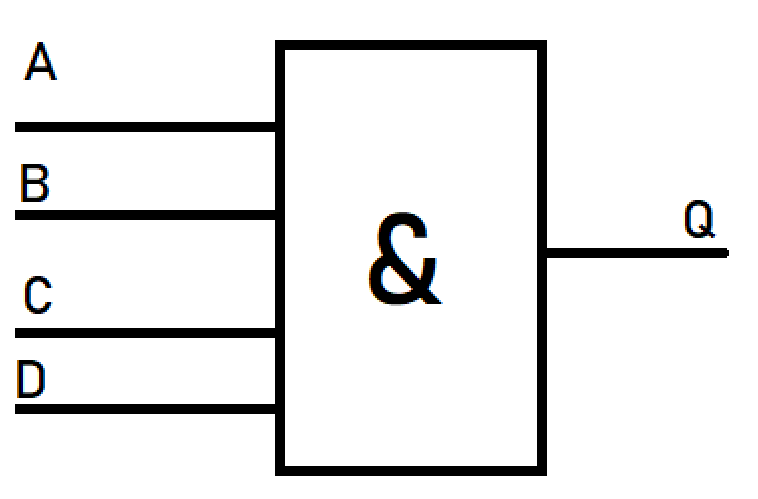
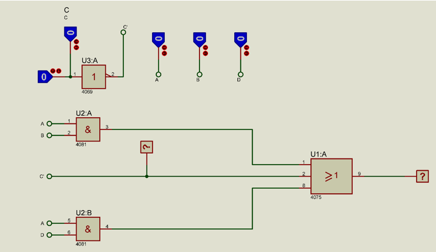

# INNLEVERING DIGITALTEKNIKK, OHMS LOV OG ARDUINO

| Dataelelektronikk:| Innleveringsfrist:|
| :-: | :-: |
| Stian Åsvestad Larsen | 22.02.2019 |


## Hva mener vi med logiske tilstander?<br>
Vi mener at det er bits (eller av eller på) funksjoner som blir enten 0 eller 1.

## 4-inngangers AND-funksjon.
### a) Tegn symbolet.


### b) Skriv det boolske uttrykket.
 

## Hvordan leser vi:
### a) `F=A∙B`
Vi leser F = SANT OG SANT slik at strømmen går når begge er på.

### b) `F=A+B`
Vi leser F = SANT ELLER SANT slik at strømmen går igjennom når enten A eller B får et 1-tall.

## Forenkle disse funksjonene:
### a)`(B+C´)∙C´∙B´ `

Forenklet: `B´∗ C´ `(NAND utrykk)

### b) `CA + A + AC + AD + D `
Forenklet: `A+D` (ELLER)

## Tegn skjema for disse uttrykkene
### a) `F=AB´+ C´+AD`


### b) `F=DE´C+AB+C`


 

## Regn ut verdien på en motstand som kobles i serie med en lysdiode. <br>
_Lysdioden skal styres fra en l en utgang på en Arduino._
_Lysdioden har følgende data: Spenning ved drift 2.4V og da går det 17mA igjennom lysdioden._<br>

<br>

## Regn ut: Strømmene `I`, `I2` og `I3`, Spenningen `UR4` og `UR5`, Effekten som omsettes i `R4`
<br>
## Spenning `UR4` og `UR5`<br>

<br>
<br>

## Effekt over `R4`
<br>

## Felles for besvarelsen av oppgavene 8 og 9

Bruk funksjonen `millis()`, dvs dere skal IKKE bruke funksjonen `delay()`!
KLASSEN i fellesskap blir enige om hvilke pinner som brukes til hva i koden så det blir likt på i alle innleveringene.
Dokumentere koden med kommentarer, evt spill inn en video der du forklarer koden muntlig.<br>
Koden skal både limes inn i Word-dokumentet og leveres separat.
Din egen test av løsningen skal filmes og legges ut på din personlige OneDrive som du har i skoleportalen, delingslinken til filmen i skal limes i Word-dokumentet så jeg kan se på testen. <br>
OBS! Legg en liten lapp med navn og klasse ved siden av Arduino'n og pass på at den blir med i filmen. Pass på å få teste dette så dere vet andre kan få åpnet fila som linken peker på, f.eks en i klassen, venn, en i familien osv. <br>
## Oppgave 8:
```arduino
/** Stian Åsvestad Larsen
 * Oppgave 8 Lyskryss uten fortauoverganger. 
 * Tid:
 * Rød = 5sek
 * RødGul = 2sek
 * Grønn = 10sek
 * Gul = 2 sek
 * Klasse: 18IT-D
*/
// Definerer hvilke "pins" som skal brukes
const int crossRed = 6;
const int crossGreen = 7;
const int LEDred = 8;
const int LEDyel = 9;
const int LEDgre = 10;


// Millis for å lagre siste sekvens. 
unsigned long LastMillis;

// Definerer LEDstate i starten så den starter på lOW.
int LEDstate = LOW;


// Intervaller på LEDs. I Oppgava er disse satt til 5 sek rød,
// 2 sek rødgul, 10sek grønn og 2 sek gul før sekvensen repeteres.
const long RedInt = 5000;
const long RedYelInt = 2000;
const long YelInt = 2000;
const long GreInt = 10000;


// Setup for sekvensen.
void setup() 

// Definerer pins som OUTPUT
{
  pinMode(crossRed, OUTPUT);
  pinMode(crossGreen, OUTPUT);
  pinMode(LEDred,OUTPUT);
  pinMode(LEDyel, OUTPUT);
  pinMode(LEDgre, OUTPUT);


  // Hvis det er behov for feilsøking
  Serial.begin(9600);

}

// Setter lightState til 0. Dette er fordi sekvensen begynner på 0. 
int lightState = 0;


// loop
void loop() {

  unsigned long currentMillis = millis();


// Denne IF-setningen eller sekvensen sjekker om lightState er 0 og oppdaterer den til 1. Den sjekker også om sekvensen har en intervall.   
  if ((currentMillis - LastMillis >= YelInt) && (lightState == 0))
  {
      Serial.println("Rødt lys");
      lightState = 1;
      digitalWrite(LEDred, HIGH);
      digitalWrite(LEDyel, LOW);
    
    // Oppdaterer forrige millis med denne slik at denne blir den nye "millis". LastMillis vil da være 1 etter denne sekvensen.
    LastMillis = currentMillis;
  }
  if ((currentMillis - LastMillis >= RedInt) && (lightState == 1))
  {
      Serial.println("Rødt og gult lys");
      lightState = 2;
      digitalWrite(LEDred, HIGH);
      digitalWrite(LEDyel, HIGH);

    // Oppdaterer forrige millis med denne slik at denne blir den nye "millis". LastMillis vil da være 2 etter denne sekvensen. 
      LastMillis = currentMillis;
  }
  if ((currentMillis - LastMillis >= RedYelInt) && (lightState == 2))
  {
    Serial.println("Grønt lys");
    lightState = 3;
    digitalWrite(LEDred, LOW);
    digitalWrite(LEDyel, LOW);
    digitalWrite(LEDgre, HIGH);

    // Oppdaterer forrige millis med denne slik at denne blir den nye "millis". LastMillis vil da være 3 etter denne sekvensen.
    LastMillis = currentMillis;
  }
  if ((currentMillis - LastMillis >= GreInt) && (lightState == 3))
  {
    Serial.println("Gult lys, restarter sekvens");
    lightState = 0;
    digitalWrite(LEDgre, LOW);
    digitalWrite(LEDyel, HIGH);

    // Oppdaterer forrige millis med denne slik at denne blir den nye "millis". LastMillis vil da være 0 etter denne sekvensen.
    LastMillis = currentMillis;
  }
  
}
```
Lage trafikklys ved hjelp av lysdioder.

Sekvensen skal repeteres i det uendelige.

| Trinn:| Tid(sek):|
| :-: | :-: |
| 1 | 5 |
| 2 | 2 |
| 3 | 10 |
| 4 | 2 |

## Oppgave 9.

Trafikklyset for bilen skal virke som i oppgave 8 helt til det trykkes på bryteren.
| Når fotgjengeren har trykket på bryteren skjer følgende sekvens||
| :-: | :-: |
| 5 sek etter bryteren er trykket skal biltrafikken stanses etter standard sekvensen i oppgave 8. | |
| Etter at bilene er stanset får fotgjengerne konstant grønt lys. | Dere bestemmer tiden fotgjengerne skal kunne bruke. |
| Når tiden for grønt lys er utløpt skal den grønne lysdioden blinke 10 ganger for å varsel fotgjengerne at tiden er ute.  | 250 ms blinke/pause er ok. |
| Fotgjengerne får rødt lys | |
| Vent 500 ms så kan trafikklyset begynne å slippe fram bilene etter standard sekvens fra oppgave 8. | 


## FILM:<br>

[Trykk her for linken til film.](https://opplandvgs-my.sharepoint.com/:v:/g/personal/stla0904_fs-innlandet_no/Ef_cJTVJIRtHjAp-FbVOmqEBOGwWXZkKtyj-Mgtu-da5bQ?e=w00NgU)


## Kode:
```arduino
/** 
 * Oppgave 9, Trafikklys med fotgjengerfelt.
 * Stian Åsvestad larsen
 * 18IT-D
 */

// Definerer hvilke "pins" som skal brukes
    int crossRed = 6;
    int crossGreen = 7;
    int LEDred = 8;
    int LEDyel = 9;
    int LEDgre = 10;

// Definerer bryteren som skal brukes. 
    const int pedBtn = 11;

// Millis for å lagre siste sekvens. 
    unsigned long LastMillis;

// Intervaller på LEDs. I Oppgava er disse satt til 5 sek rød,
// 2 sek rødgul, 10sek grønn og 3 sek gul før sekvensen repeteres.
    const long RedInt = 5000;
    const long RedYelInt = 2000;
    const long YelInt = 3000;
    const long GreInt = 10000;

// Setup for sekvensen.
void setup() 

// Definerer pins som OUTPUT. 
{
    pinMode(crossRed, OUTPUT);
    pinMode(crossGreen, OUTPUT);
    pinMode(LEDred,OUTPUT);
    pinMode(LEDyel, OUTPUT);
    pinMode(LEDgre, OUTPUT);

  // Setter pinmode til ,bryter.
    pinMode(pedBtn, INPUT);

  // Hvis det er behov for feilsøking
    Serial.begin(9600);

    // Setter default rødt lys på trafikk og rødt lys på fotgjengerovergang.
    digitalWrite(LEDred, HIGH);
    digitalWrite (crossRed, HIGH);
}

// Setter lightState til 0. Dette er fordi sekvensen begynner på 0. 
    int lightState = 0;

// Lagring av når sist knappen ble trykket. 
    unsigned long BtnPress;

// Hvor lenge lyset til fotgjengere skal lyse
    const long pedInt = 7500;

// Diverse variabler som brukes. Holder styr på "FOR" loop blinking. 
    int count = 0;

// Trafikken går når denne variableen står til 0. 
    int trafficState = 0;

// Delay på rødt lys når sekvensen restarter. 
    int delayRed = 500;

// Setter trafikkstart slik at sekvensen til trafikklys starter. 
    int trafficStart = 0;

// Variabel for å dobbeltsjekke om knappen trykkes. 
    unsigned long debounceDelay = 100;

// Variabel for å sjekke om lyset er rødt. 
    int pedStateRed = 0;

void trafficStatusStop() 
{
    trafficStart = 1;
}

void pedestratianGo()
{
    pedStateRed = 1; //Fotgjengere kan gå
}

void pedestratianStop()
{
    pedStateRed = 0;
}
// Oppdaterer millis. 
void updateMillis()
{
    LastMillis = millis();
}
// Rødt lys. 
void redState()
{
    Serial.println("Rødt Lys");
    digitalWrite(LEDred, HIGH);
    digitalWrite(LEDyel, LOW);
}
// Rød og Gult lys. 
void redYelState()
{
    Serial.println("Rødt og Gult lys");
    digitalWrite(LEDred, HIGH);
    digitalWrite(LEDyel, HIGH);
}

// Grønt lys.
void greState()
{
    Serial.println("Grønt lys.");
    digitalWrite(LEDred, LOW);
    digitalWrite(LEDyel, LOW);
    digitalWrite(LEDgre, HIGH);
}

// Gult lys. 
void YelState()
{
    Serial.println("Gult lys.");
    digitalWrite(LEDgre, LOW);
    digitalWrite(LEDyel, HIGH);
}

// Status om knapp har blitt trykket. 
bool pedestrianShouldStart = false;

// Status om fotgjengerlys har startet. 
bool pedestrianStartNow = false;

    // loop
void loop() 
    // Trafikklys
{
    bool isButtonPressed = digitalRead(pedBtn) == HIGH;

    // For å lagre millis
    unsigned long currentMillis = millis();

    // Denne IF-setningen eller sekvensen sjekker om lightState er 5 og oppdaterer den til 1. Den sjekker også om sekvensen har en intervall.   
    if ((lightState == 5) && (currentMillis - LastMillis >= delayRed))
    {
        lightState = 0;

        // Oppdaterer forrige millis med denne slik at denne blir den nye "millis".
        updateMillis(); // LastMillis = currentMillis;
    }

    /** Sjekker om "lightState" er 0, og TrafficStart er 0. 
     * Hvis den er det setter den lightState til 1, mens den skriver ut "rødt lys" samtidig som den bytter til rødt lys igjen. 
     * Den oppdaterer også millis til "currentMillis" og pedStateRed til 1.
     */ 
    if (!pedestrianStartNow && (currentMillis - LastMillis >= YelInt) && (lightState == 0) || trafficStart == 0)
    {
        redState(); // Rødt trafikklys. 

        // Oppdaterer forrige millis med denne slik at denne blir den nye "millis".
        updateMillis(); // LastMillis = currentMillis;

        trafficStatusStop(); // trafficStart = 1;

        // Sjekker om knapp blir trykket og fortsetter trafikklys. Oppdaterer millis. 
        if (pedestrianShouldStart) {
            pedestrianShouldStart = false;
            pedestrianStartNow = true;
            BtnPress = currentMillis;
        } 
        else {
            lightState = 1;
        }
    }

    /** Sjekker om lightState er 1.
     * Hvis den er 1, settes den til 2. Den skriver ut "Rødt og Gult lys" samtidig som den setter rødt og gult lys til HIGH.
     * Tilslutt setter den forrige millis til nåværende millis og oppdaterer pedStateRed til 0 igjen. 
     */ 
    if ((currentMillis - LastMillis >= RedInt) && (lightState == 1)) {
        lightState = 2;

        redYelState(); // Rødt og Gult Trafikklys.

        // Oppdaterer forrige millis med denne slik at denne blir den nye "millis".
        updateMillis(); // LastMillis = currentMillis;        
    }

    /** Sjekker om lightState er 2.
     *  Hvis den er 2, oppdaterer den verdien til 3, mens den skfiter til grønt lys og skriver ut "Grønt lys."
     * Tilslutt setter den forrige millis til nåværende millis.
     */ 
    if ((currentMillis - LastMillis >= RedYelInt) && (lightState == 2)) {
        lightState = 3;
        greState(); // Grønt Trafikklys. 

        // Oppdaterer forrige millis med denne slik at denne blir den nye "millis".
        updateMillis(); // LastMillis = currentMillis;
        
    }

    /** Sjekker om lightstate er 3 og setter lightState tilbake til 0 så den repeterer sekvensen. 
     * Den setter lyset til gult og skriver ut "Gult lys" før den oppdaterer forrige millis til nåværende millis.
     */
    if ((currentMillis - LastMillis >= GreInt) && (lightState == 3)) {
        
        lightState = 0;
        YelState(); // Gult Trafikklys. 

        // Oppdaterer forrige millis med denne slik at denne blir den nye "millis".
        updateMillis(); // LastMillis = currentMillis;

    }
    // Sjekker om knapp er trykket.
    if (isButtonPressed == true && (currentMillis - LastMillis >= debounceDelay)) {

        Serial.println("Knapp er trykket."); // Skriver ut "Knapp er trykket"
        pedestrianShouldStart = true; // Setter knapp til true slik at fotgjengersekvens aktiveres. 
    }
    // Sjekker om fotgjengerlys skal starte. 
    if (pedestrianStartNow) {
        digitalWrite(crossRed, LOW);
        digitalWrite(crossGreen, HIGH);
    }

    // Blinking
    if (trafficStart == 1 && pedestrianStartNow) {   
        if (currentMillis - BtnPress >= pedInt) 
        {
            digitalWrite(LEDgre, LOW);
            digitalWrite(LEDred, HIGH);
            digitalWrite(LEDyel, LOW);
            digitalWrite(crossRed, LOW);
            digitalWrite(crossGreen, HIGH);
            
            updateMillis(); // LastMillis = currentMillis;

            // Sekvensen som gjør at lyset blinker.
            for(int count = 1; count < 15; count++)
            {
                Serial.println("Blink");
                digitalWrite(crossGreen, LOW);
                delay(250);
                digitalWrite(crossGreen, HIGH);
                delay(250);
            }
            
            // Setter fotgjengerlys til rødt. 
            digitalWrite(crossGreen, LOW);
            digitalWrite(crossRed, HIGH);
            // Oppdaterer lightstate til 5 for å resette sekvensen og trafficStart til 0. Dette er fordi den skal treffe sekvensen øverst. 
            Serial.println("Fotgjengerlys tilbake til standard");
            lightState = 5;
            trafficStart = 0;
            // Setter knappeverdi tilbake til "standard" og oppdaterer millis. 
            pedestrianStartNow = false;
            Serial.println("Restart trafikk");
            delay(500);
            updateMillis();
        }
    }
}

```